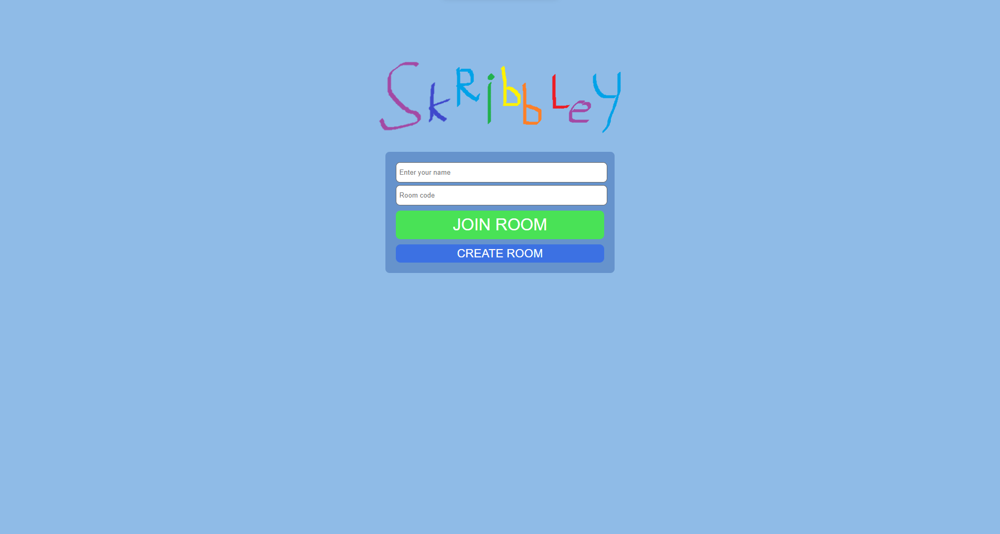

# Skribbley
***NOTE: This project is a work in progress and mostly incomplete.***

Skribbley is an online multiplayer game based on drawing and guessing. <br />
There are future plans to add different gamemodes.



# Installation and Testing

## Testing
You can test out the site at https://skribbley.onrender.com. <br />
It may take a while to load.

## Installing

### Installing required packages:
```bash
pip install -r requirements.txt
```

### Running on a development server:
```bash
flask run
```
The app will start running locally at http://127.0.0.1:5000.
